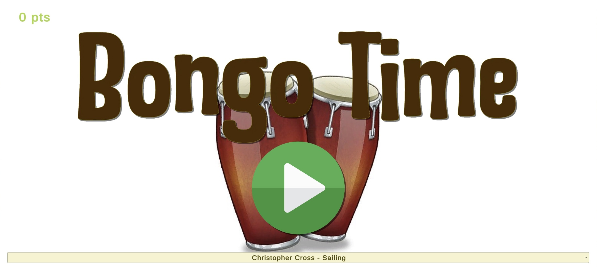
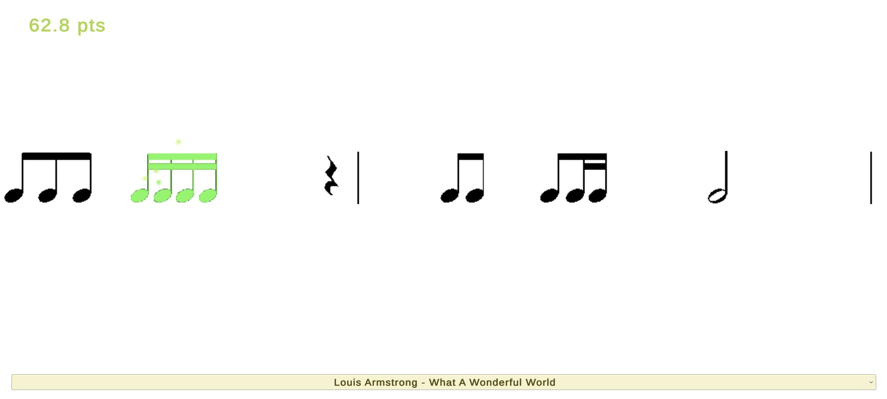

# 2024fa-475-Craddock

## Bongo Time
Endlessly play the bongos to the beat of the music.

## Screenshots

## Run the game
- MacOS: run ``Bongo Time.app``

(see releases section)
- iOS or Android: clone the project and use [Unity Remote](https://docs.unity3d.com/Manual/UnityRemote5.html)

## Gameplay
- Press the play button to begin the game, or tap the bottom bar to select a new song.
- Listen to the special yellow notes as they demonstrate how to play the rhythm. Then, press the space bar in time with the sheet music to score points.
- As your score increases, the rhythms will increaes in difficulty to match your skill.

## About
I developed Bongo Time as a solo project for CSCI 475: Video Game Design at Millersville University. It is designed to be played on a mobile device, although a Mac version of it is available in the releases section. The goal of the project was to create a game that had some practical or educational use. I chose to make a game that would teach people basic rhythms and help them practice their rhythm.

As part of the project, I had to perform a short user study on the game's effectiveness as an educational tool. I ran the game on my phone using Unity Remote and asked a handful of students to play the game, and then fill out a survey rating their experience. The results of the survey can be found [here](https://docs.google.com/spreadsheets/d/1UNXNWJFp-mhDUEtBb-eGues1iPa3qvLgrb0GtTpbiLI/edit?usp=sharing).

The responses to the survey seemed to show that most players felt like they improved from the game, and some even thought they would be more comfortable reading sheet music after playing. I also got great feedback on how to improve the game, the most common of which was that there should be a better visual indication of when to hit the notes. I wanted to prevent players from only relying on visuals for when to tap the screen, but I now think that a visual indicator would be really helpful for getting players back on track when they're missing notes.

Overall, the game accomplished my goal of being a way for people to learn and improve their rhythm, although there are many ways in which it could be improved. 

## Author
Lincoln Craddock
